# 计算实习题

## 说明
有很多计算机程序设计语言可以用来完成计算实习。本文章采用数学软件MATLAB来解决数学实习题，习题解答包括主程序、程序调用命令和程序执行结果三个部分。

### 方程的近似求解

1. 用二分法求下列方程的一个近似解（精确到小数点后第六位）

    (1) $x^3+3x-5=0,x^* \in [1,2]$;

    (2) $x= e^{-x}, x^* \in [\frac12, \ln 2]$;

    (3) $x^2 = \cos x, x^* \in [\frac{\pi}4,\frac{3\pi}4]$;

    (4) $7x^2-3x+\frac4x-30=0,x^* \in [2,2.5]$.

解：
二分法主程序(bisect.m)

（1）运行情况如下
.png)

（2）运行情况如下
.png)

（3）运行情况如下
.png)

（4）运行情况如下
.png)

2. 用Newton法求下列方程的近似解（精确到小数点后第10位）

    （1）$x^3-x+4=0$；

    （2）$x^2+\frac {1}{x^2} = 10x$ $(x>1)$；

    （3）$x\lg x = 1$；

    （4）$x+e^x = 0$

    （5）$\frac x2= \sin x$ $(x>0)$

解：Newton法主程序（Newton.m）

（1）运行情况如下
.png)

（2）运行情况如下
.png)

（3）运行情况如下
.png)

（4）运行情况如下
.png)

（5）运行情况如下
.png)

3. 用Newton法导出计算机上求$A^{\frac1x}$($A>0$,n为非零整数)和$\frac1A$的算法（即只用加、减、乘三种运算的算法），并实际计算下列各值：

    （1）$\sqrt[3]{2}$；

    （2）$\frac1{\sqrt[5]{9}}$；

    （3）$\frac17$；

    （4）$\frac1{11}$；

解：设$f(x)=x^n-A$,$f'(x)=nx^{n-1}$，迭代公式为$$x_{k+1}=x_{k}-\frac{x^n_k-A}{nx^{n-1}_k}=\frac{n-1}{n}x_k+\frac{A}{nx^{n-1}_k};$$

开n次方的Newton法程序代码（Newton1.m）

（1）运行情况如下
.png)

（2）运行情况如下
.png)

（3）运行情况如下
.png)

（4）运行情况如下
.png)


4. 当$\epsilon=0.2$时,计算Kepler方程$$y= x-\epsilon\sin y=0  (0<\epsilon<1)$$ 对应于$x=\frac{k}{8} (k=1,2,...,8)$的y的近似值.

解：
k=1时，
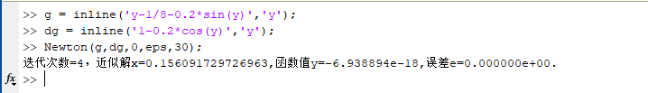
k=2时，
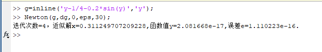
k=3时，
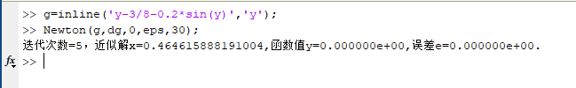
k=4时，
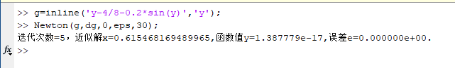
k=5时，
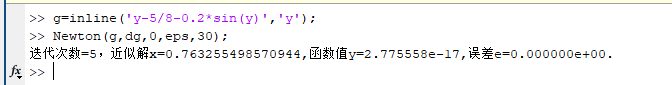
k=6时，
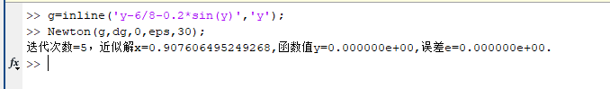
k=7时，
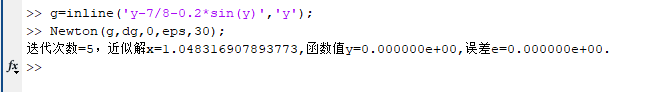
k=8时，
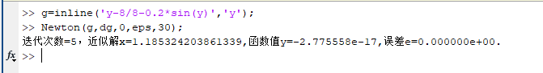
5. 求方程$\tan x=x$的最小的三个正根，精确到$10^{-12}$.

解：首先粗略估计三个正根为4.4，7.6和10.9，然后带入计算。
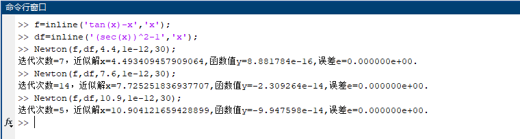

6. 求方程$\cot x = \frac{1}{x} - \frac{x}{2}$的两个正根，精确到$10^{-12}$.

解：显然，方程有无穷多个正根，粗略估计两个最小的正根为2和6，带入程序计算。


### 定积分的数值计算
1. 利用 $\pi= \displaystyle \int^{1}_{0}{\frac{dx}{1+x^2}} $，$π = 3.141592653589793238462643...$
    
    （1）用普通的梯形公式、Simpson公式和Cotes公式，计算圆周率$\pi$的近似值并与精确值加以比较；

    （2）将区间[0,1]分成4、8等分，用复化梯形公式和复化Simpson公式计算$\pi$的近似值，并与精确值比较；
    
    （3）用Romberg方法计算$\pi$的近似值，使它的精度达到O($10^{-8}$);

    （4）分别用n=1,2,3,4的Gauss-Legendre公式计算$\pi$的近似值，并与前面的计算结果进行比较。

解：

（1）

主程序（integral.m）


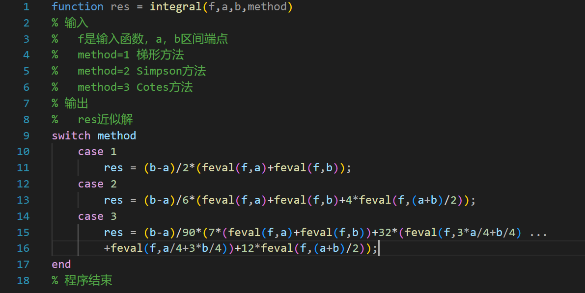

运行情况如下：
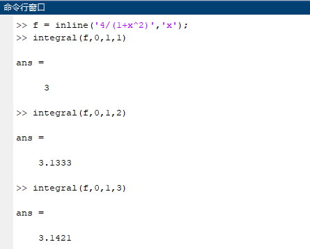

Cotes公式精度最高，Simpson公式其次，梯形公式最低。

（2）
 
复化梯形公式主程序（trapezoid.m）
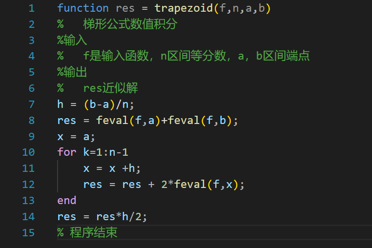
复化Simpson公式主程序（simpson.m）
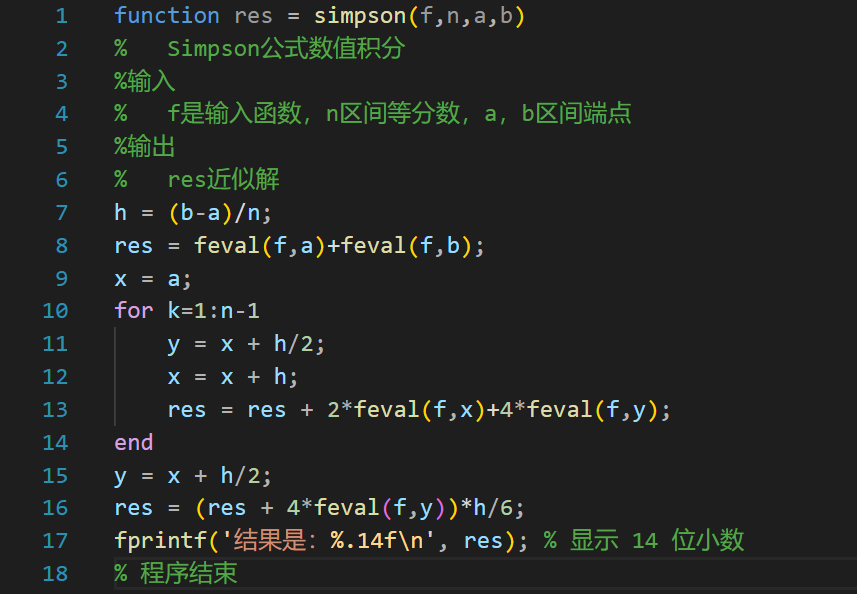
分别代入n=4和n=8,计算结果如下：

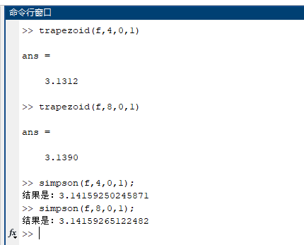

n=8时比n=4时计算精度更高，Simpson公式计算精度比梯形公式高得多。

（3）

Romberg方法计算数值积分主程序（romberg.m）

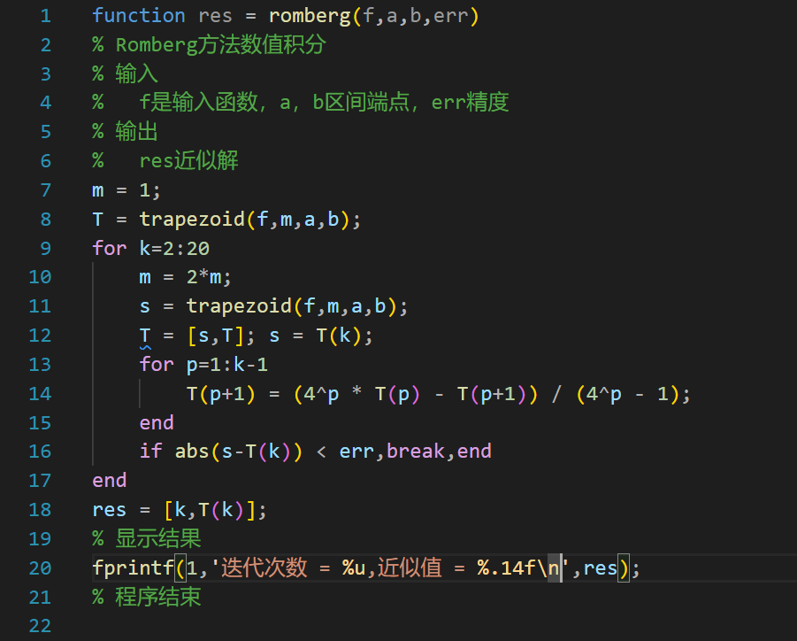

计算结果：

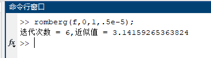

(4) Gauss-Legendre公式主程序（GaussLegendre.m）

分别使用n=1,n=2,n=4代入计算可得：

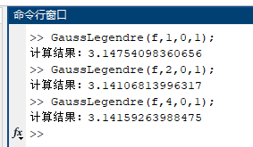

在n值相同的情况下，Gauss-Legendre公式的精确度比复化Simpson公式还要精确。


2. 设河面宽20m,从河的一岸向另一岸每隔2m测得的水深（单位：m）如下：

|  x  |  0  |  2  |  4  |  6  |  8  |  10  |  12  |  14  |  16  |  18  |  20  |
|-----|-----|-----|-----|-----|-----|------|------|------|------|------|------|
|  y  |  0  | 0.6 | 1.4 |  2.0   |  2.3   |   2.1   |  2.5    |  1.9    |  1.2    |  0.7    |  0    |

求河流的横断面积。

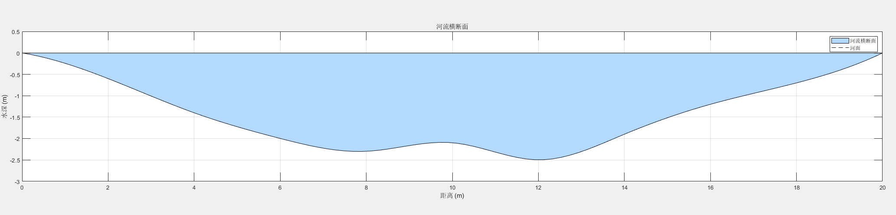

解：使用复化梯形公式，a=0,b=20,n=10。程序如下：

```
x = 0:2:20;
y = [0, 0.6, 1.4, 2.0, 2.3, 2.1, 2.5, 1.9, 1.2, 0.7, 0];
A = y(1)+y(11);
for k=2:10
    A = A + y(k)*2;
end
A = A*2/2
```

运行结果：
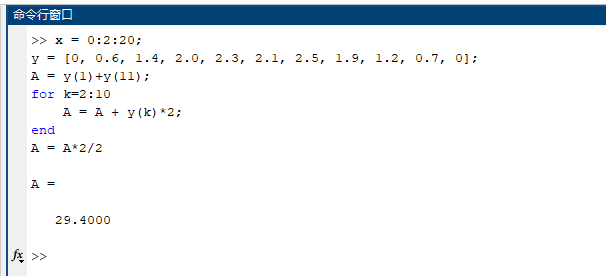

3. 分别用复化梯形公式和复化Simpson公式计算下列积分：

    （1）$\displaystyle \int^{1}_{0}{e^{x^2}dx},m=16$；

    （2）$\displaystyle \int^{\pi}_{0}{\frac{1-cosx}{x}dx},m=8$；
（可看成连续函数$
f(x) =
\begin{cases} 
\frac{1-cosx}{x} & \ x \neq 0, \\
0 & \ x = 0.
\end{cases}
$的积分）

    （3）$\displaystyle \int^{1}_{0}\sqrt{1-x^3}dx,m=8$;

    （4）$\displaystyle \int_{0}^{2} \frac{e^{-x}}{1+x^2}dx,m=8$.

解

（1）
复化梯形公式
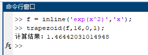

复化Simpson公式
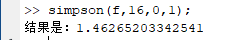

（2）
定义函数

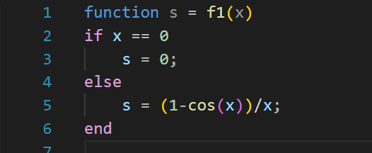

复化梯形公式

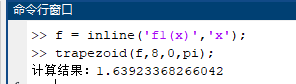

复化Simpson公式


(3)
复化梯形公式

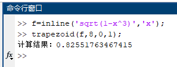

复化Simpson公式

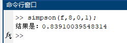

(4)
复化梯形公式

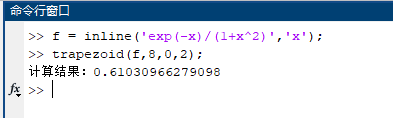

复化Simpson公式

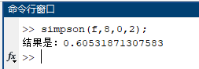


4. 用Romberg计算$\displaystyle \int^{2}_{1}\frac{dx}{x}$，精确到小数点后第8位.

解

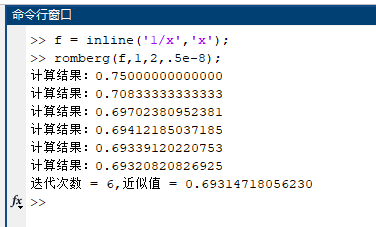

5. 用一般的积分区间上的Gauss-Legendre公式（取n=4）计算积分$\displaystyle I(N)=\int^{N}_{0}{e^{-x^{2}}}dx$：

（1）$N=1$；

（2）$N=3$；

（3）$N=10$.

并与$\lim_{x \to \infty} \displaystyle \int^{N}_{0}e^{-x^{2}}dx=  \frac{\sqrt{\pi}}{2}$的结果相比较。

解

计算[0,1]上的积分：
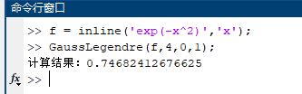

计算[1,3]上的积分：
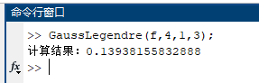

计算[3,10]上的积分:
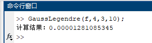

于是[0,3]上积分近似于前两段积分之和0.88620568509513，[0,10]上积分近似于三段积分之和0.88621849594859，而$\sqrt{\pi}/2\approx0.886227$,精确到小数点后5位。

6. 按照第3题（2）同样的观点，计算

$f(x) = \int^{x}_{0}\frac{\sin t}{t}dt$ $(x=\frac{k\pi}{3},k=1,2,...,6)$
并作出$f(x)$的大致图形.

解：

定义函数后，利用Gauss-Legendre公式，取n=4，依次代入k=1,2,3,...,6进行计算。
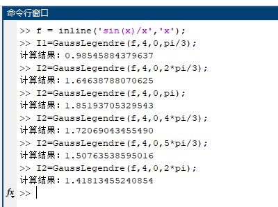

图像如下
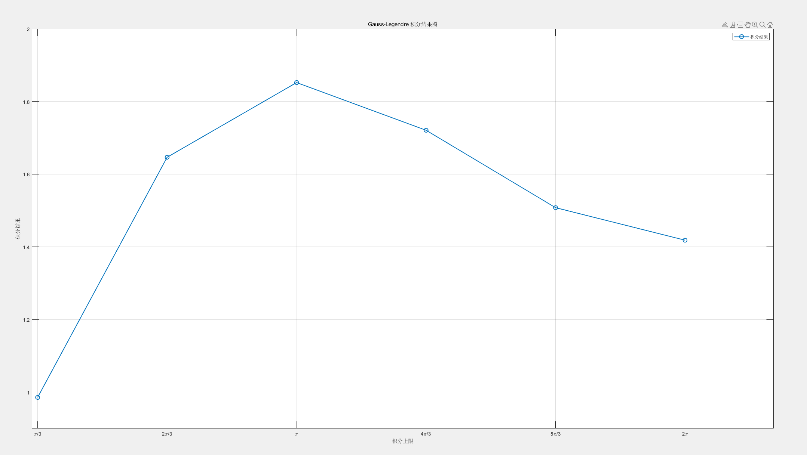


### 反常积分的概念和计算


1. 试编制一个通用的Gauss-Legendre求积公式程序，在计算机上实际计算下列反常积分值，并与精确值比较：

（1）$\displaystyle \int^{1}_{0}\frac{ln(1-x)}{x}dx$, 精确值$-\frac{\pi^{2}}{6}$;

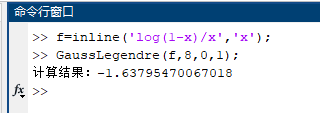
积分近似值：-1.6449


（2）$\displaystyle \int^{1}_{0}\ln x\ln(1-x)dx$, 精确值$2-\frac{\pi^{2}}{6}$;

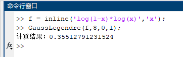
积分近似值：0.3551

（3）$\displaystyle \int^{+\infty}_{0}\ln \cos xdx$, 精确值$-\frac{\pi}{2}\ln 2$;

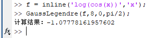
积分近似值：-1.0888

（4）$\displaystyle \int^{1}_{0}\frac{\sin x}{x}dx$, 精确值$\frac{\pi}{2}$;

由于积分收敛较慢，根据Gauss-Legendre公式计算特点，取n=8,并将积分分段计算再求和，编写程序如下（ex4.m）
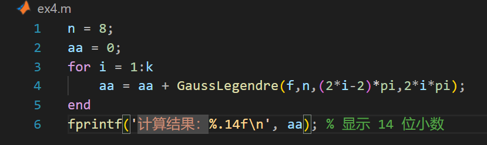


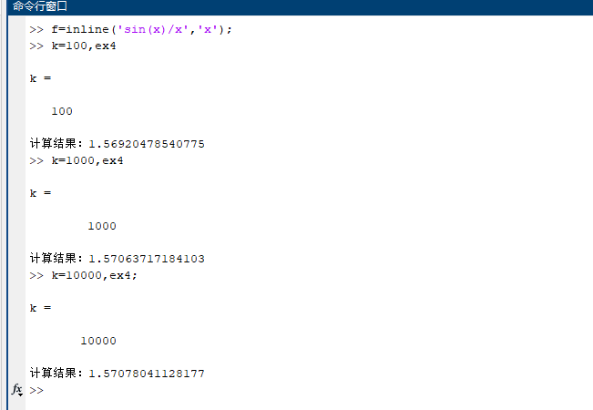

积分近似值：1.57079632679490，积分上限A计算到$20000\pi$时可得到较高的精度。

（5）$\displaystyle \int^{+\infty}_{0}\sin (x^{2})dx$, 精确值$\frac{1}{2}\sqrt{\frac{\pi}{2}}$.

作变量代换，$u=x^{2}$, 则$dx = \frac{1}{\sqrt{u}}du$,积分化为$\displaystyle \int^{+\infty}_{0}\frac{\sin u}{2\sqrt{u}}du$

利用上一小题方法计算如下：

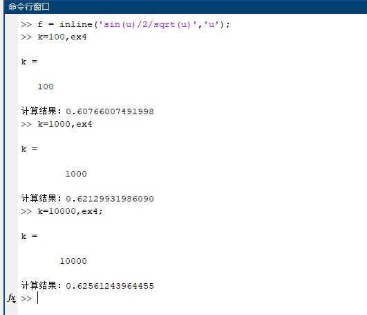

积分近似值0.62665706865775,可以看出积分上限A计算到$2000\pi$时得到的结果精确度不高，这是由于原积分收敛速度较慢的原因。